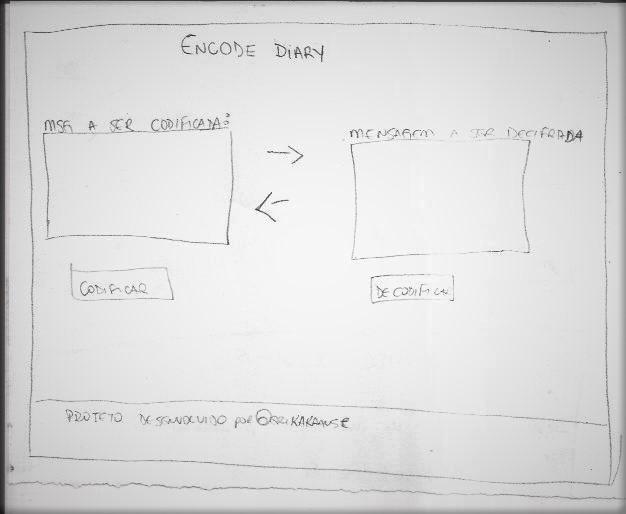

# Cifra de César

## Índice

- [1. Prefácio](#1-prefácio)
- [2. Projeto](#2-projeto)
- [3. Funcionamento](#4-funcionamento)
- [4. Considerações finais](#7-considerações-finais)

## 1. Prefácio

A cifra de César é um dos primeiros tipos de criptografias conhecidas na história.
O imperador romano Júlio César utilizava essa cifra para enviar
ordens secretas aos seus generais no campo de batalha.

A cifra de César é uma das técnicas mais simples de cifrar uma mensagem. É um
tipo de cifra por substituição, em que cada letra do texto original é
substituida por outra que se encontra há um número fixo de posições
(deslocamento) mais a frente do mesmo alfabeto.

Atualmente todas as cifras de substituição alfabética simples, são decifradas
com facilidade e não oferecem muita segurança na comunicação por si mesma,
mas a cifra de César muitas vezes pode fazer parte de um sistema
mais complexo de criptografia, como a cifra de Vigenère, e tem aplicação no sistema ROT13.

### 1.1 História de usuário

Bridget Jones é uma mulher de 32 anos que, em pleno Ano Novo, decide que já está mais do que na hora de tomar o controle de sua própria vida, com isso, aproveita também para colocar suas opiniões sobre os mais diversos assuntos de sua nova vida em seu diário. Acidentalmente acaba perdendo o seu amigo confidente.

**Capa do Livro**:

## 2. Projeto

O projeto tem como objetivo criar uma página Web para criptografar o texto que será escrito em seu diário e assim manter a seguridade das suas opiniões alheias.
## 3. Funcionamento

Na primeira caixa de texto você poderá inserir o seu texto, podendo ser ele com letras minúscula ou maíscula, porém neste momento a aplicação não aceita acentuações ou caracteres especiais, mas pode colocar ponto (.) e vírgula (,) para melhorar o fluxo do texto.

## 4. Protótipo

Rascunho feito no papel da estruturação simples do layout:

## 5. Considerações finais
Este é o primeiro projeto apresentado como requisito de aprendizagem para a Laboratoria.

**Tecnologias utilizadas para p desenvolvimento do projeto:**
- HTML 
- CSS 
- JavaScript 
- Trello para planejamento do projeto

